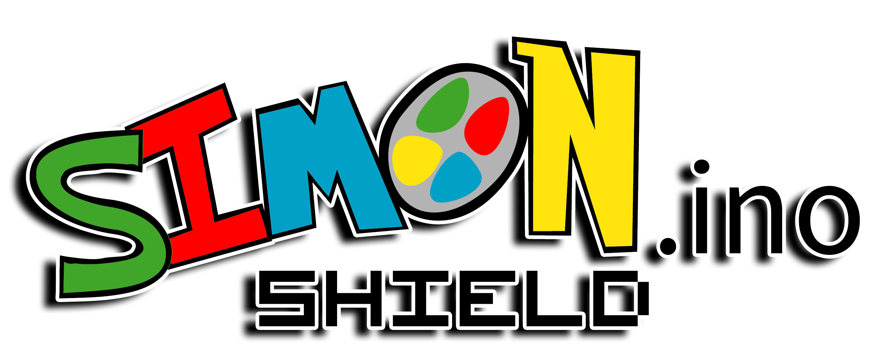

  

 

**Attention:** This project is currently under development. If you want to contribute, please let us know. Feel free to submit your ideas and/or code.  
Thank you.

## What is SIMON.ino

**Simon.ino** is a Shield for Arduino Uno inspired by the game of memorizing colors Simon Says.

Simon.ino is an open source prototyping circuit board `PCB` aimed to students and beginners alike. The shield
has build in LEDs, push buttons, a small OLED display and `Bluetooth` connectivity, which makes it an attractive
base to learn microcontroller programming (electronics-programming interaction). Simon.ino can be programmed
in form of Blocks (for beginners, such as young students) or the native Arduino IDE (Integral Development Environment), which is a subset of the popular C++, for more advance learners.

[`Arduino IDE`] (https://www.arduino.cc/en/main/software) or  
[` ArduinoBlocks`] (http://www.arduinoblocks.com/) and the like.

Simon.ino can be used by teachers at schools to promote [S.T.E.M.] subjects (https://en.wikipedia.org/wiki/Science,_technology,_engineering,_and_mathematics), as well as at home.

## What do you want to achieve:

- [x] Functional "PCB Shield" board.
  - [x] 4 Buttons with illumination or
  - [x] 4 push buttons + 4 colored LEDs.
  - [x] 3 control buttons.
  - [x] 1 Led on/off.
  - [x] 1 Led Aux.
  - [x] 1 OLED 0.96" I2C.
  - [x] 1 Bluetooth HC5.
  - [x] 1 Analog control.
  - [x] 1 i2C Aux port.
  - [ ] ...
  - [ ] Firmware
  - [x] Test to functions [[Link_local](https://github.com/carlymx/SIMON.ino-Shield/tree/master/codes/ArduinoBlocks/ArduinoBlocks-Test01)][[Link_ArduinobBlocks](http://www.arduinoblocks.com/web/project/159761)].
  - [ ] SIMON.ino simple game.
  - [ ] SIMON.ino Multiplayer game.
  - [ ] Multiplayer Bluetooth game.
  - [ ] Pong game.
  - [ ] Tetris game.
  - [ ] Other games.
  - [ ] Other Community Purposes.
  - [ ] Web Space.
  - [ ] Space where to give visibility to the project.
  - [ ] A record of players.
  - [ ] Ranking, Records.
  - [ ] Organize Multiplayer Tournaments.
  - [ ] A place where the community can contribute.
  - [ ] ...
  - [ ] Community
  - [ ] ...

**Project links**   
GitHub: https://github.com/carlymx/simon.ino   
TinkerCAD:  https://www.tinkercad.com/things/0SQZt1JyzZw   
EasyEDA: https://easyeda.com/carlymx/simon-ino-shield
